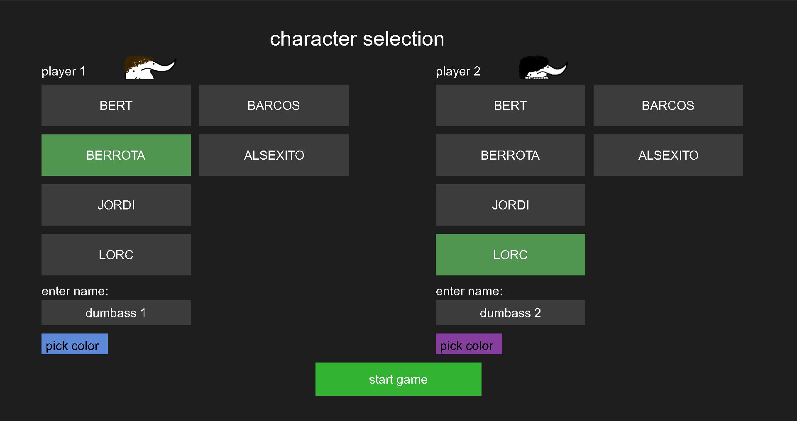
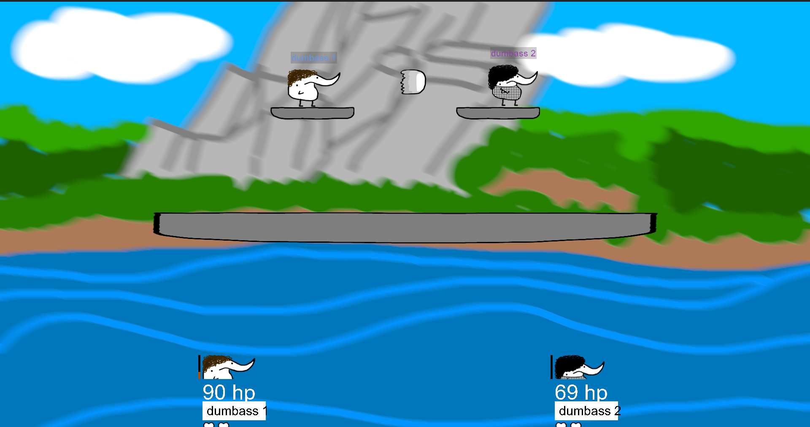
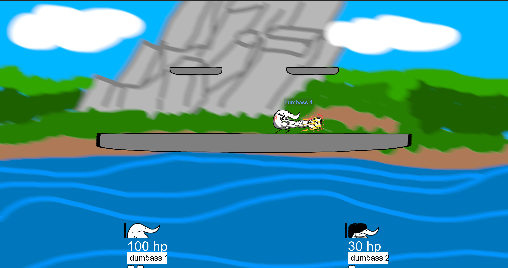

# super bert bros

> please don't sue me nintendo

super bert bros is a local (and now remote too) multiplayer brawler game, heavily inspired by the Super Smash Bros saga. choose from a roaster of unbalanced weirdos to bully your friend into quitting life.

## features

- **local multiplayer** - one keyboard, two dumbasses
- **p2p online** - challenge a friend remotely
- **special moves** - once you get a full charge, you'll be able to do more powerful moves
- **hand drawn sprites** - see credits section
- **goofy ahh sfx** - will make you want to ditch your eardrums
- **items!** - make your battles less fair with crappy abilities!

## controls (now with controller)

### player 1 (the one on the left side)

| action       | key          | controller button |
|--------------|--------------|-------------------|
| move left    | `A`          | `Ljoystick ←`     |
| move right   | `D`          | `Ljoystick →`     |
| move down    | `S`          | `Ljoystick ↓`     |
| jump         | `SPACE`      | `A`               |
| shoot        | `E`          | `B`               |
| melee        | `W`          | `X`               |
| special      | `Q`          | `Y`               |

### player 2 (the one that's not on the left side)

| action       | key          |
|--------------|--------------|
| move left    | `←`          |
| Move Right   | `→`          |
| move down    | `↓`          |
| jump         | `↑`          |
| shoot        | `RCTRL`      |
| melee        | `RSHIFT`     |
| special      | `ENTER`      |

### misc.

| key           | function               |
|---------------|------------------------|
| `B`           | toggle debug rendering |
| `F11`         | toggle fullscreen      |
| `ESC`         | pause game             |
| `F7`          | rage quit              |
| `F6`          | cheat menu             |

> *special moves are directional:* hold a movement key and press the special key to perform a directional special attack, or don't to perform a static special attack (stronger punch)
> *parries are a thing now!:* melee attack a projectile to reflect it back at double speed

## berts (character)

| name        | hp     | dmg    |
|-------------|--------|--------|
| BERT        | 100    | 12     | 
| BERROTA     | 110    | 10     | 
| JORDI       | 90     | 14     |
| LORC        | 120    | 8      |
| BARCOS      | 105    | 11     | 
| ALSEXITO    | 95     | 13     |

> *more berts will be added in the future*

## remote play

### hosting a game

1. select **"online multiplayer"** in the main menu.
2. choose **"host game"**.
3. wait for the client to connect (the game will show their IP).
4. pick characters - the game will automatically send the setup to the client.

### joining a game

1. select **"online multiplayer"** -> **"join game"**.
2. enter the host's IP address and port (default `67689`).
3. wait for the host to start the match

> **note:** there will be lag. cry about it.

## screenshots

## building from source

### dependencies

on arch:

`sudo pacman -S sdl2 sdl2_image sdl2_mixer sdl2_ttf sdl2_net`

### building

`./run.sh` will do (or `./win.sh` if you want to cross-compile for windows)

### credits

- **music:** *bounce* by фрози and joyful (not made for me)
- **sprites:** melee and special done by [IVZA](https://www.youtube.com/@IVZA-d6h), some other sprite might have been done by [Tafeef](https://youtube.com/@Tafeef), and titlescreen bg by Anubis7356; everything else done by myself
- **code:** all done by myself, with a tad bit of Claude's help for the networking

### contributions

yes please :P